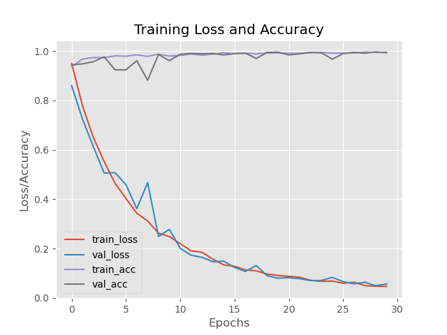

# Face Mask Detector Project
This is a project developed in connection with the course Advanced Machine Learning & Deep Learning.

## Purpose
In light of the ongoing pandemic I wanted to develop a ML-project that could contribute to the infection prevention 
measures. As surveillance of citizens should be kept to a minimum (and within GDPR), I think this project would mostly 
contribute with statistics on the degree of compliance with the requirements and advise given by the state, without the 
collection of personal identifiable information. For instance, as a way of collecting information on how efficient the 
measures are, and if additional measures are needed in order to mitigate the spread.

## Results
The training and validation Loss and Accuracy of the classifier model are shown in the graph below. Both graphs seem to 
decrease and there hardly any gap between the training and validation accuracy. This means that there is no signs of under- 
or overfitting.



## How to run the trained Face Mask Detector
1. Check that you have the required [dependencies](#dependencies) installed.
2. The already trained model has to be downloaded and saved in the root folder named *face-mask-detection*.
Download it from [Google Drive](https://drive.google.com/drive/folders/1G778QCfgwynOQDfMbhB0XrYsUHN-sWoW?usp=sharing).
3. Go to the Real-Time Face Mask Detector with the filename *real_time_face_mask_detector.py*
4. You might have to change the capturing device (or you could insert a video file) in line 113 of the code, depending 
on the devices you have connected.

    * Using WebCam
    ```python
    capture = cv2.VideoCapture(0, cv2.CAP_DSHOW)
    ```
   * Using a video file
   ```python
    capture = cv2.VideoCapture("filename.mp4")
    ```
   
5. Run the file and press the key 'q' to exit the Video Capture when your done testing the Detector

## Details
### File Description
* ***classifier_model.model***: The trained model used when running the Face Mask Detector
* ***plot.png***: Plot of the loss and accuracy results from training the model
* ***realtime_detector.py***: The Real-Time Face Mask Detector Code
* ***training.py***: The Training code for the classifier model, where the Neural Network Structure is defined
* ***Face Detectors/***: Contains files from OpenCV's deep neural network module, created by Aleksandr Rybnikov
	* ***deploy.prototxt***: Stores the structure of the neural network of the res10 model
	* ***res10_300x300_ssd_iter_140000.caffemodel***: stores the trained weights of the network

### Dependencies
* [Tensorflow](https://www.tensorflow.org/install)
* [OpenCV](https://pypi.org/project/opencv-python/)
* [Imutils](https://pypi.org/project/imutils/)
* [NumPy](https://numpy.org/install/)

### Neural Network Architecture
The MobileNetV2 neural network architecture is used for the classification problem. Read more about the architecture 
[here](https://arxiv.org/abs/1801.04381).

### Dataset
The dataset consists of images from the MaskedFace-Net dataset and the FFHQ dataset.
- Link to the original dataset:
  - MaskedFace-Net dataset: https://github.com/cabani/MaskedFace-Net
  - FFHQ dataset: https://github.com/NVlabs/ffhq-dataset
  
***Note: For the training of the classifier, only the first two folders in both MaskedFace-Net and FFHQ datasets were used. 
These folders are named 00000 and 00001 in the original datasets.***
